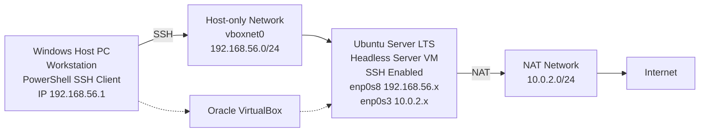
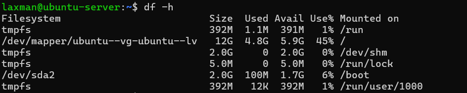
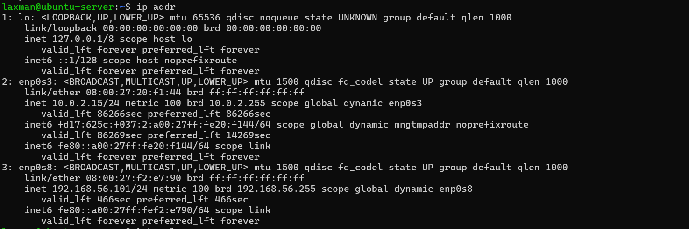
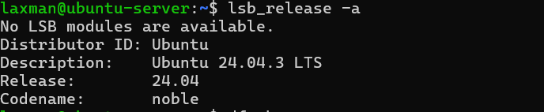

# Week 1 – System Planning and Distribution Selection

## 1. System Architecture Overview

This system consists of a Windows host machine acting as the workstation and an Ubuntu Server LTS virtual machine deployed as a headless server. Oracle VirtualBox is used as the virtualization platform. The server does not use a graphical interface and is administered remotely using Secure Shell (SSH) from the Windows workstation via PowerShell.

Two virtual network interfaces are configured to separate internal communication from external connectivity. A host-only network is used to enable secure local communication between the workstation and the server, while Network Address Translation (NAT) provides controlled internet access for software updates and package management.

---

## 2. System Architecture Diagram


--- 

## 3. Server Distribution Selection and Justification

Ubuntu Server LTS (Live Server) was selected as the operating system for the headless server due to its stability, long-term support lifecycle, and suitability for server environments. The Long-Term Support (LTS) release provides up to five years of security and maintenance updates, reducing the need for frequent upgrades and ensuring system reliability.

The server was deployed without a graphical user interface, which minimises resource usage and improves performance. Ubuntu Server includes native support for Secure Shell (SSH), allowing remote administration, as well as modern network configuration using Netplan and reliable package management through the Advanced Package Tool (APT).

### Comparison with Alternative Distributions

- **Debian**: Offers strong stability but requires more manual configuration and has a steeper learning curve for initial setup.
- **CentOS Stream**: Uses a rolling-release model, which may introduce instability and unexpected changes during coursework.
- **Fedora Server**: Provides up-to-date software but has a short support lifecycle and requires frequent upgrades.

Ubuntu Server LTS was chosen as it provides the best balance between stability, documentation, ease of use, and suitability for academic server deployment.

---

## 4. Workstation Configuration Decision

The workstation role is fulfilled by the Windows host operating system. Windows was selected due to its built-in SSH client available through PowerShell, which allows secure remote access to the headless Ubuntu Server without the need for additional software.

Using the host operating system as the workstation reduces system overhead while maintaining full functionality for remote administration. PowerShell provides a reliable command-line environment for executing SSH connections and managing the server, aligning with the requirements of the assignment.

---

## 5. Network Configuration Documentation

The Ubuntu Server virtual machine was configured with two network adapters in Oracle VirtualBox to separate internal communication from external connectivity.

### Adapter 1 – Network Address Translation (NAT)
- Purpose: Provides internet access for system updates and package installation.
- IP Address Range: `10.0.2.x`

### Adapter 2 – Host-only Adapter (vboxnet0)
- Purpose: Enables secure local communication between the Windows workstation and the Ubuntu Server.
- IP Address Range: `192.168.56.x`
- Subnet Mask: `255.255.255.0`

This dual-network configuration allows the server to access external repositories while remaining isolated from public networks. SSH access from the workstation is restricted to the host-only network, improving security.

---

## 6. CLI-Based System Specification Documentation

System specifications were documented using command-line interface tools executed on the Ubuntu Server.

### Kernel and Architecture Information
```bash
uname -a
```

*Figure 2: Output of the `uname -a` command showing the Linux kernel version and system architecture of the Ubuntu Server.*

```bash
free -h
```

*Figure 3: Output of the `free -h` command displaying total, used, and available system memory.*

```bash
df -h
```

*Figure 4: Output of the `df -h` command showing disk usage and available storage on mounted file systems.*

```bash
ip addr
```

*Figure 5: Output of the `ip addr` command confirming network interfaces and assigned NAT and host-only IP addresses.*

```bash
lsb_release -a
```

*Figure 6: Output of the `lsb_release -a` command identifying the installed Linux distribution and version.*


## Week 1 Reflection

During Week 1, I planned and deployed a headless Ubuntu Server LTS system using Oracle VirtualBox, with a Windows host machine acting as the workstation. This phase helped me understand the importance of system planning before deployment, particularly when selecting an appropriate operating system, workstation environment, and network configuration.

One of the key learning outcomes was understanding the difference between server and workstation roles. Deploying Ubuntu Server without a graphical interface highlighted how headless systems reduce resource usage and rely entirely on command-line administration. Using Windows PowerShell to manage the server via SSH demonstrated how remote administration is commonly performed in real-world server environments.

A significant challenge encountered during this phase was configuring networking correctly within VirtualBox. Issues related to host-only adapters and IP address assignment required troubleshooting and a deeper understanding of how NAT and host-only networks function together. Resolving these issues improved my confidence in diagnosing network configuration problems and reinforced the importance of careful setup and verification.

Documenting system specifications using CLI tools such as `uname`, `free`, `df`, and `ip addr` improved my familiarity with Linux command-line utilities and their role in system administration. Capturing and interpreting this output helped confirm that the system was correctly configured and operating as expected.

Overall, this phase provided a strong foundation for future work by combining theoretical planning with practical implementation. The experience has improved my understanding of virtualised environments, headless server management, and secure remote access, which will be built upon in subsequent weeks.
