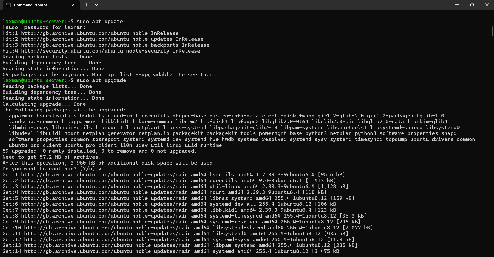
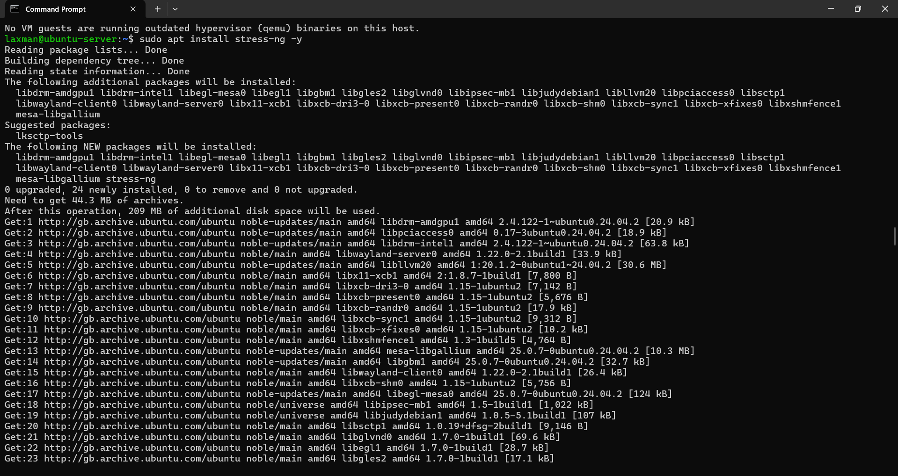
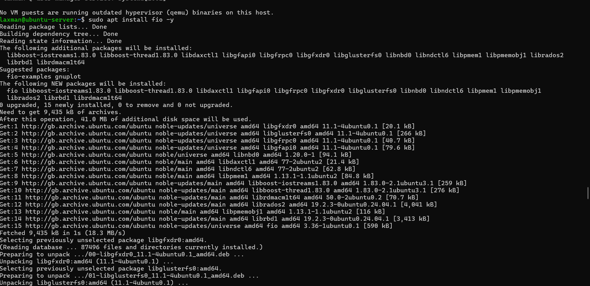
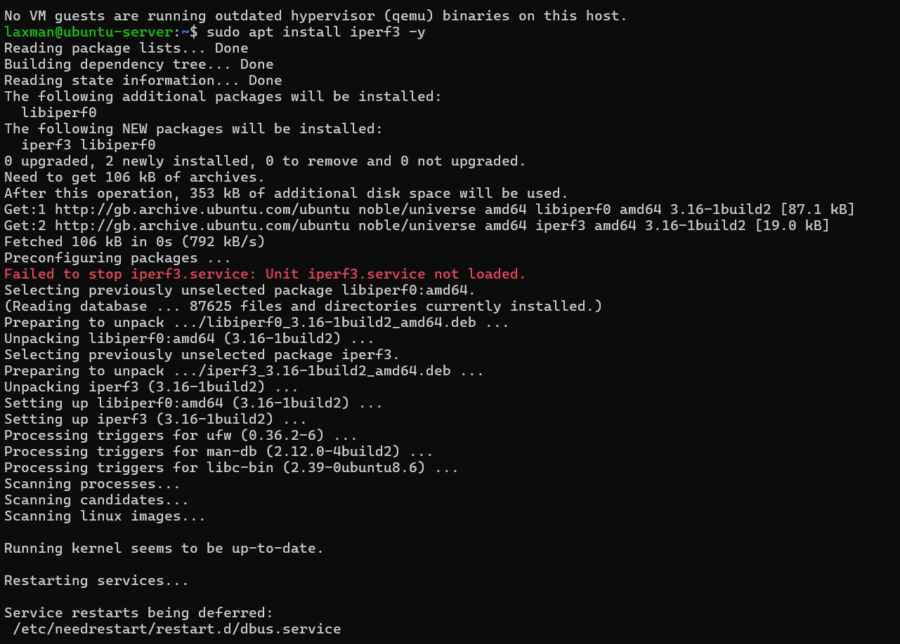
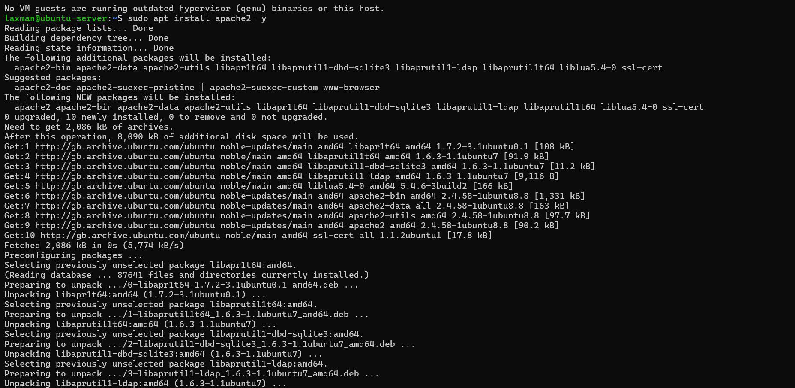

# Week 3 – Application Selection and Performance Evaluation Planning

## 1. Application Selection Matrix

To evaluate system performance under different workload conditions, a range of applications representing distinct workload types were selected. Each application was chosen based on its ability to stress specific system resources in a controlled and measurable way.

| Workload Type        | Application        | Justification |
|----------------------|--------------------|---------------|
| CPU-intensive        | stress-ng          | Designed to generate high CPU load and simulate real-world computational stress scenarios. |
| RAM-intensive        | stress-ng (vm)     | Allows controlled memory allocation and pressure testing of system RAM. |
| I/O-intensive        | fio                | Commonly used benchmarking tool for testing disk read/write performance and I/O throughput. |
| Network-intensive    | iperf3             | Widely used for measuring network bandwidth, latency, and throughput between systems. |
| Server Application   | Apache Web Server  | Represents a real-world server workload handling client requests and background services. |

These applications collectively provide a comprehensive overview of system performance across different resource domains.

---

## 2. Installation Documentation (SSH-Based)

All applications were installed remotely on the Ubuntu Server using SSH from the Windows workstation. The following commands were executed on the server.

### System Update
```bash
sudo apt update && sudo apt upgrade -y
```


*Figure 1: System update performed using the APT package manager prior to application installation.*

```bash
ssudo apt install stress-ng -y
```

*Figure 2: Output from the `stress-ng` tool demonstrating CPU and memory intensive workload execution.*

```bash
sudo apt install fio -y
```

*Figure 3: Disk I/O performance testing using the `fio` benchmarking tool.*

```bash
sudo apt install iperf3 -y
```

*Figure 4: Network performance testing conducted using `iperf3` to measure throughput.*

```bash
sudo apt install apache2 -y
```

*Figure 5: Apache web server installation and service status confirming server application deployment.*

