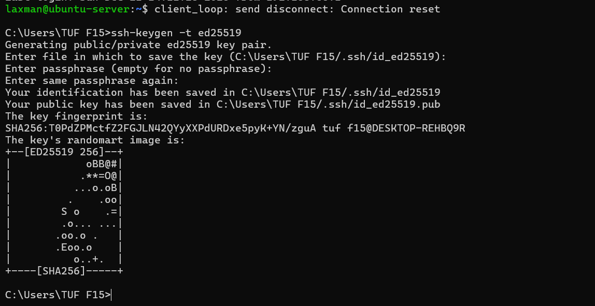
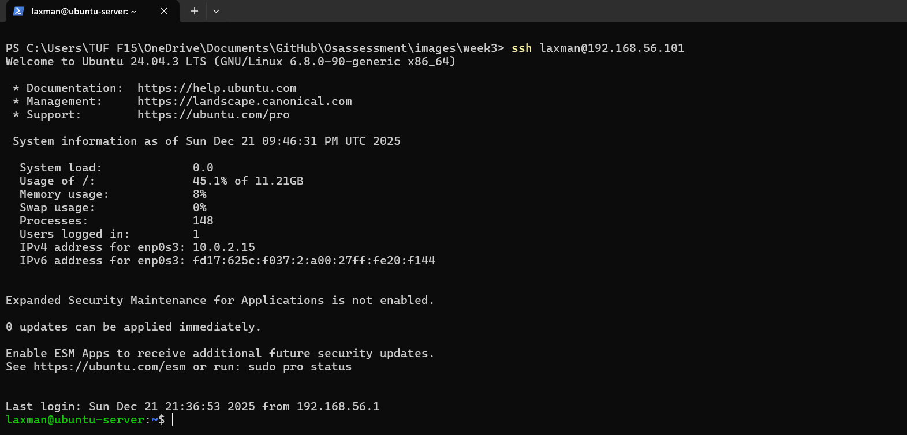
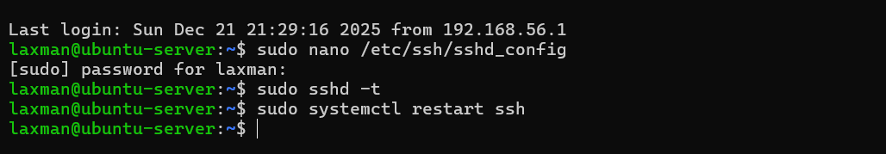
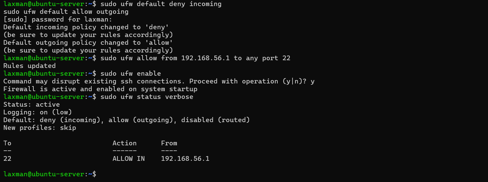
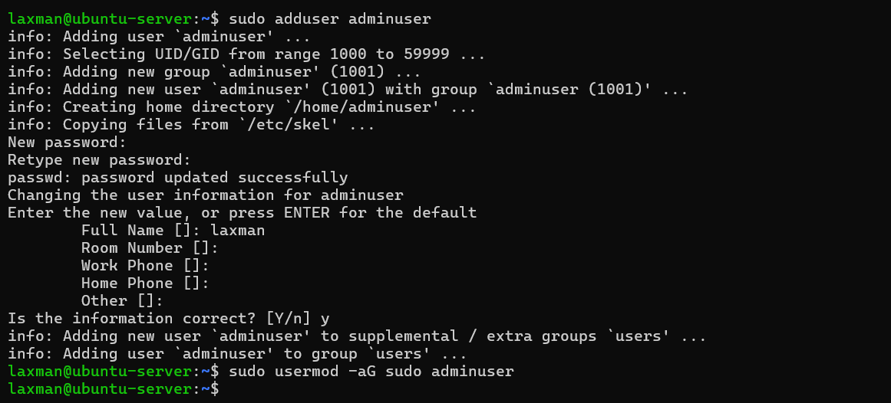
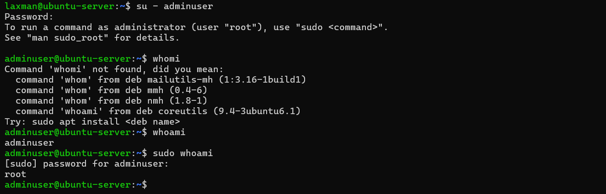

# Week 4 – Initial System Configuration and Security Implementation

## Administrative Constraint

All server configuration tasks in this phase were performed remotely via SSH from the workstation. No direct console or local access to the server was used at any stage. This reflects real-world server administration practices and complies with the module’s administrative constraint.

---

## 1. SSH Configuration with Key-Based Authentication

SSH was configured to use key-based authentication to improve security and prevent password-based login attacks.

### SSH Key Generation (Workstation)

An SSH key pair was generated on the workstation using the following command:

```bash
ssh-keygen -t ed25519
```


*Figure 1: SSH key pair generation on the workstation to enable key-based authentication.*



*Figure 2: Successful SSH login to the server without a password, confirming key-based authentication.*

---

## SSH Hardening Configuration

The SSH service was hardened to reduce the risk of unauthorised access and brute-force attacks. Password-based authentication was disabled, and direct root login was prevented to enforce secure access control.

The SSH daemon configuration file was edited remotely via SSH using the following command:

```bash
sudo nano /etc/ssh/sshd_config
```

The following configuration options were applied to harden the SSH service:

- `PasswordAuthentication no` – Disables password-based authentication to prevent brute-force login attempts.
- `PermitRootLogin no` – Prevents direct SSH access using the root account.
- `PubkeyAuthentication yes` – Enforces the use of SSH key-based authentication.

After applying these changes, the SSH configuration was validated to ensure that no syntax errors were present:

```bash
sudo sshd -t


```bash
sudo sshd -t
```

The SSH service was then restarted to apply the new settings:

```bash
sudo systemctl restart ssh
```


*Figure 3: SSH daemon configuration showing password authentication disabled and root login prevented.*

Successful passwordless SSH login confirmed that key-based authentication was correctly enforced.
---

## Firewall Configuration with Restricted SSH Access

The Uncomplicated Firewall (UFW) was configured to restrict SSH access to a single trusted workstation, reducing the server’s exposure to unauthorised network connections.

Default firewall policies were applied to deny all incoming traffic while allowing outgoing connections:

```bash
sudo ufw default deny incoming
sudo ufw default allow outgoing
```
SSH access was explicitly permitted only from the authorised workstation IP address:
```bash
sudo ufw allow from 192.168.56.1 to any port 22
```

The firewall was then enabled to enforce the configured rules:

```bash
sudo ufw enable
```

The firewall configuration was verified using the following command:

```bash
sudo ufw status verbose
```


*Figure 4: UFW firewall ruleset showing SSH access restricted to a single trusted workstation IP address.*

This configuration ensures that SSH access is limited exclusively to the authorised workstation, significantly reducing the risk of unauthorised remote access.

---

## User and Privilege Management Evidence


*Figure 5: Creation of a non-root administrative user and assignment of sudo privileges.*


*Figure 6: Demonstration of privilege escalation using sudo by a non-root administrative user.*
