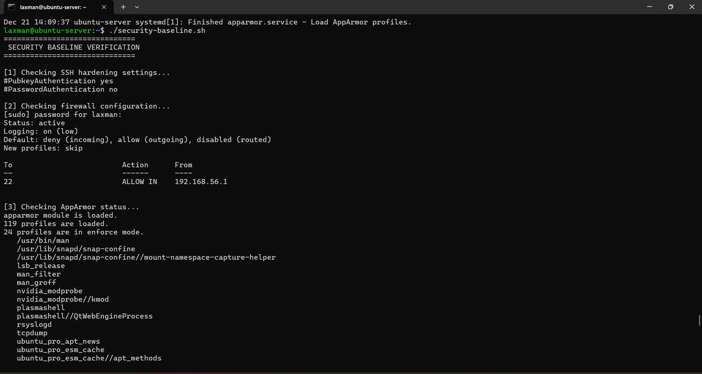
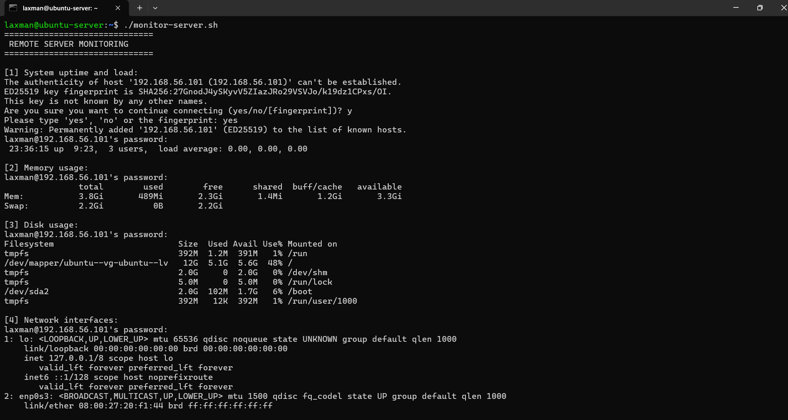

# Week 5 – Advanced Security and Monitoring Infrastructure

## 1. Mandatory Access Control (AppArmor)

Mandatory Access Control (MAC) was implemented using AppArmor to further strengthen system security. AppArmor restricts application behaviour by enforcing security profiles that limit access to system resources, even if a service is compromised.

AppArmor is enabled by default on Ubuntu Server and was verified using the following command:

```bash
sudo aa-status
```


*Figure 1: Output of the `aa-status` command confirming that AppArmor is active and enforcing security profiles.*

This command confirms that AppArmor is active and enforcing security profiles on system services.

### Monitoring and Reporting Access Control Events

To monitor AppArmor activity and detect potential policy violations, system logs were reviewed using:

```bash
sudo journalctl -u apparmor
```


*Figure 2: AppArmor service logs showing access control monitoring and enforcement activity.*

This allows administrators to track denied actions and audit application behaviour, providing visibility into enforced access control policies.

---

## Automatic Security Updates

Automatic security updates were configured to ensure that critical security patches are applied promptly without requiring manual intervention. This reduces the risk of system compromise due to known vulnerabilities remaining unpatched.

The unattended upgrades package was installed using the following command:

```bash
sudo apt install unattended-upgrades -y
```

Automatic updates were then enabled and configured using:
```bash
sudo dpkg-reconfigure unattended-upgrades
```

This configuration ensures that security updates are downloaded and installed automatically in the background.

The configuration was verified by inspecting the automatic updates settings file:
```bash
cat /etc/apt/apt.conf.d/20auto-upgrades
```


*Figure 3: Configuration file output confirming that unattended security updates are enabled.*

Enabling automatic security updates helps maintain system security by ensuring timely patching of vulnerabilities without relying on manual administrator intervention.

---

## Intrusion Detection and Prevention with Fail2Ban

Fail2Ban was implemented to provide intrusion detection and prevention by protecting the SSH service against brute-force authentication attempts. Fail2Ban monitors system log files for repeated failed login attempts and automatically blocks offending IP addresses using temporary firewall rules.

Fail2Ban was installed on the server using the following command:

```bash
sudo apt install fail2ban -y
```


*Figure 4: Terminal output showing the successful installation of Fail2Ban and its required dependencies on the server.*

The Fail2Ban service was enabled and started to ensure it runs automatically on system startup:

```BASH
sudo systemctl enable fail2ban
sudo systemctl start fail2ban
```

To confirm that the SSH protection jail was running and monitoring authentication attempts, the following command was used:

```bash
sudo fail2ban-client status
sudo fail2ban-client status sshd
```


*Figure 5: Fail2Ban enabled and running, with the SSH jail active and monitoring authentication attempts.*

## Security Baseline Verification Script

A security baseline verification script was created to validate all security configurations implemented during Weeks 4 and 5. The script was executed directly on the server via SSH and provides a consolidated verification of key security controls.

The script verifies the following security components:
- SSH hardening configuration
- Firewall status and access restrictions
- AppArmor enforcement
- Automatic security updates configuration
- Fail2Ban service and SSH jail status
- Active non-root user context

The script was executed using the following command:

```bash
./security-baseline.sh
```


Figure 6: Output of the security baseline verification script confirming SSH hardening, firewall configuration, AppArmor enforcement, automatic updates, and Fail2Ban status.

The output confirms that all required security controls are active and correctly enforced, providing assurance that the server complies with the defined security baseline.

---

## Remote Monitoring Script

A remote monitoring script was developed on the workstation to collect system performance metrics from the server via SSH. This approach allows the server to be monitored without direct console access, reflecting standard practices used in real-world server administration.

The monitoring script connects securely to the server and collects the following metrics:
- System uptime and load averages
- Memory usage
- Disk usage
- Network interface configuration

The script was executed from the workstation using the following command:

```bash
./monitor-server.sh
```


Figure 7: Output of the remote monitoring script showing system uptime, memory usage, disk utilisation, and network interface information collected via SSH.

The output confirms that performance data was successfully retrieved from the server remotely. This demonstrates effective SSH-based monitoring capability and provides visibility into the server’s operational state.

---

## Week 5 Reflection

During Week 5, I implemented advanced security controls and monitoring capabilities to further strengthen the server infrastructure. Configuring mandatory access control using AppArmor improved my understanding of how system-level security policies can restrict application behaviour and limit the impact of potential compromises. Reviewing AppArmor status and logs highlighted the importance of continuous visibility when enforcing access control mechanisms.

Enabling automatic security updates reinforced the importance of maintaining system security through timely patch management. This task demonstrated how automation can reduce administrative overhead while ensuring that known vulnerabilities are addressed promptly. Implementing Fail2Ban provided practical insight into intrusion detection and prevention by actively monitoring authentication attempts and responding to suspicious behaviour in real time.

Developing and executing the security baseline verification and remote monitoring scripts enhanced my confidence in automating security validation and performance monitoring tasks. These scripts consolidated multiple security checks into repeatable processes and demonstrated how SSH can be used effectively for remote administration and monitoring. Overall, this phase strengthened my ability to implement layered security controls and maintain secure, monitored server environments in a professional context.
