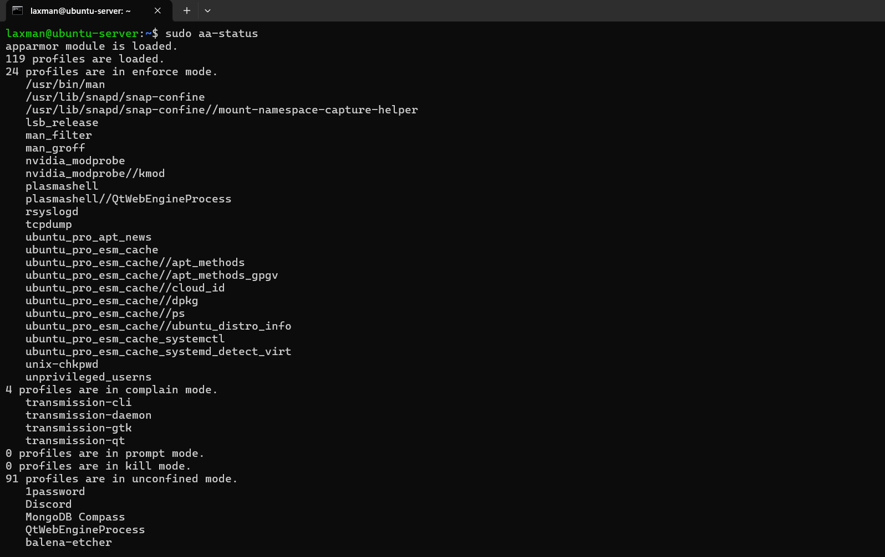
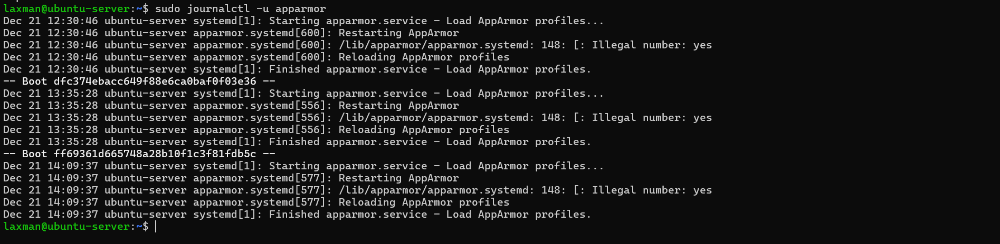
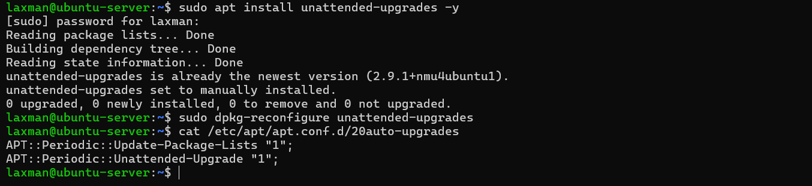
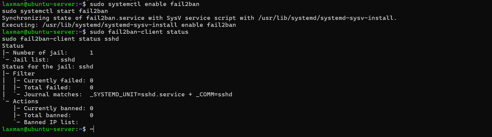
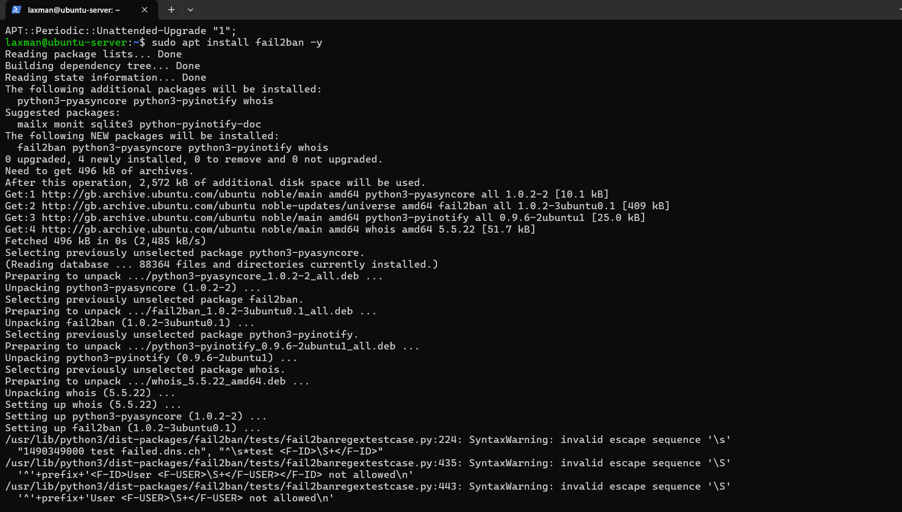

# Week 5 – Advanced Security and Monitoring Infrastructure

## 1. Mandatory Access Control (AppArmor)

Mandatory Access Control (MAC) was implemented using AppArmor to further strengthen system security. AppArmor restricts application behaviour by enforcing security profiles that limit access to system resources, even if a service is compromised.

AppArmor is enabled by default on Ubuntu Server and was verified using the following command:

```bash
sudo aa-status
```


*Figure 1: Output of the `aa-status` command confirming that AppArmor is active and enforcing security profiles.*

This command confirms that AppArmor is active and enforcing security profiles on system services.

### Monitoring and Reporting Access Control Events

To monitor AppArmor activity and detect potential policy violations, system logs were reviewed using:

```bash
sudo journalctl -u apparmor
```


*Figure 2: AppArmor service logs showing access control monitoring and enforcement activity.*

This allows administrators to track denied actions and audit application behaviour, providing visibility into enforced access control policies.

---

## Automatic Security Updates

Automatic security updates were configured to ensure that critical security patches are applied promptly without requiring manual intervention. This reduces the risk of system compromise due to known vulnerabilities remaining unpatched.

The unattended upgrades package was installed using the following command:

```bash
sudo apt install unattended-upgrades -y
```

Automatic updates were then enabled and configured using:
```bash
sudo dpkg-reconfigure unattended-upgrades
```

This configuration ensures that security updates are downloaded and installed automatically in the background.

The configuration was verified by inspecting the automatic updates settings file:
```bash
cat /etc/apt/apt.conf.d/20auto-upgrades
```


*Figure 3: Configuration file output confirming that unattended security updates are enabled.*

Enabling automatic security updates helps maintain system security by ensuring timely patching of vulnerabilities without relying on manual administrator intervention.
---


*Figure 4: Fail2Ban service started and enabled to provide intrusion detection for SSH.*


*Figure 5: Fail2Ban status output showing active monitoring of SSH authentication attempts.*


Figure 1: AppArmor status showing active and enforcing security profiles.