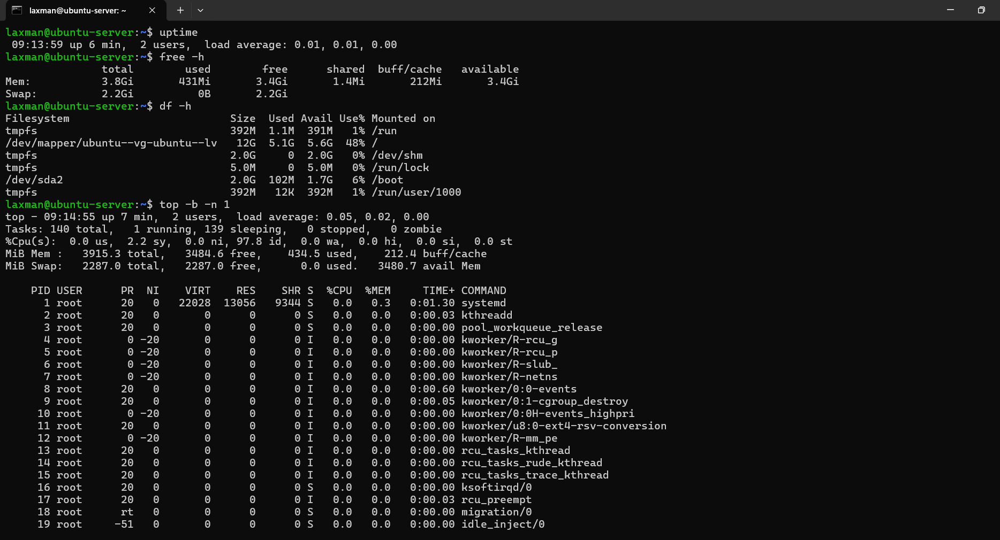
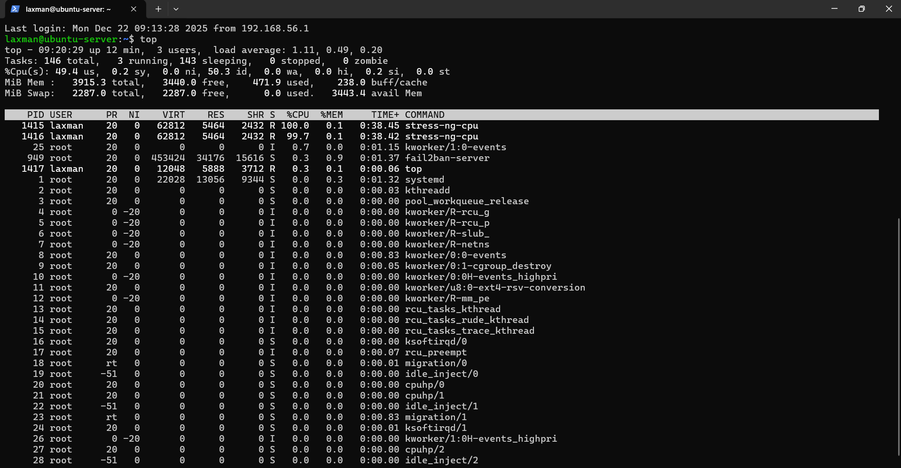
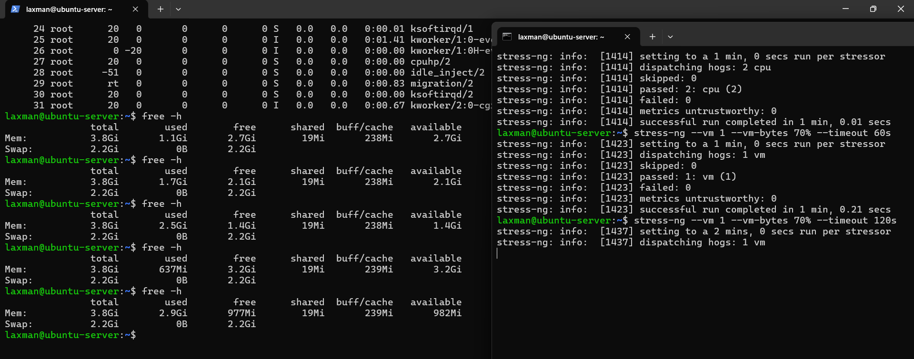
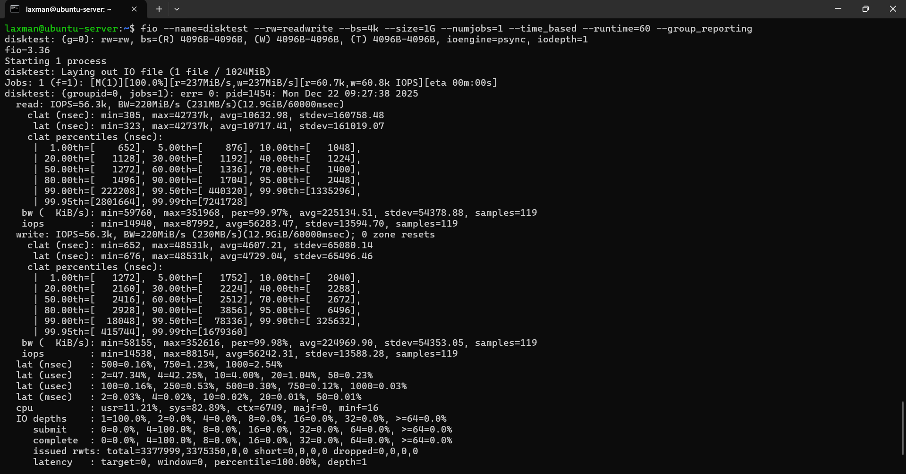
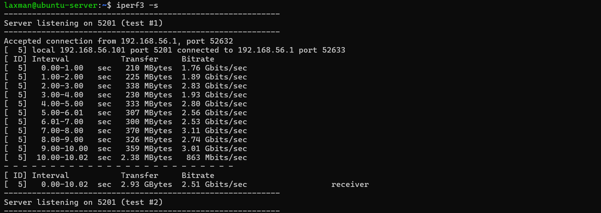
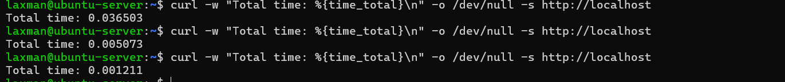
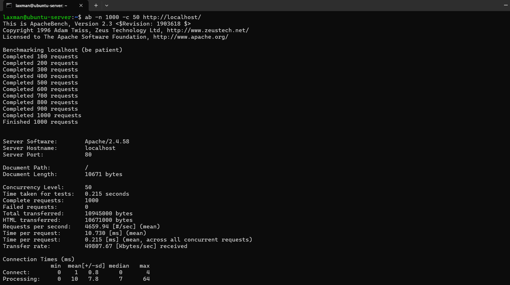

# Week 6 – Performance Evaluation and Analysis

## 1. Performance Testing Approach

The objective of this phase was to evaluate operating system behaviour under different workload conditions by measuring resource utilisation and service performance. Performance testing was conducted on the Ubuntu Server using multiple applications selected in earlier phases, each representing a different workload type.

All testing was performed remotely via SSH from the workstation to ensure consistency with real-world server administration practices. Performance metrics were collected using standard Linux command-line tools and application-specific benchmarking utilities.

The following resource metrics were monitored where applicable:
- CPU usage
- Memory usage
- Disk I/O performance
- Network throughput and latency
- System responsiveness and service response times

Testing was conducted under multiple scenarios to observe system behaviour and identify potential performance bottlenecks.

---

## 2. Testing Scenarios

Each application was tested under the following scenarios:

### Baseline Performance Testing
Baseline tests were performed while the system was in an idle or lightly loaded state. This established a reference point for normal system resource usage and performance.

### Application Load Testing
Each application was executed under controlled load to stress specific system resources such as CPU, memory, disk I/O, or network bandwidth. Performance metrics were recorded during these tests to assess the system’s response to increased workload.

### Performance Analysis and Bottleneck Identification
Collected metrics were analysed to identify resource constraints and performance bottlenecks. Observations focused on identifying which system resources became saturated under load and how this affected overall system performance.

### Optimisation Testing
At least two optimisation techniques were implemented based on observed bottlenecks. These optimisations were then tested and compared against pre-optimisation results to evaluate their effectiveness using quantitative performance data.

---

## 3. Applications and Metrics Overview

The following applications were used for performance evaluation:
- **stress-ng** – CPU and memory stress testing
- **fio** – Disk I/O performance testing
- **iperf3** – Network throughput and latency testing
- **Apache Web Server** – Service response time and server workload testing

Each application was evaluated using relevant performance metrics appropriate to its workload type.

---

## 5. Performance Data Summary

| Workload Type | Tool Used | Metric | Baseline | Under Load |
|--------------|----------|--------|----------|------------|
| CPU | stress-ng | CPU Utilisation | ~1% | ~100% |
| Memory | stress-ng (vm) | RAM Used | ~430 MB | ~2.9 GB |
| Disk I/O | fio | Throughput | N/A | ~230 MB/s |
| Network | iperf3 | Bandwidth | N/A | ~2.5 Gbit/s |
| Web Server | curl | Response Time | ~0.002–0.03 s | ~10.7 ms |
| Web Server | ApacheBench | Requests/sec | N/A | ~4659 req/s |

---

## 6. Performance Visualisations (Evidence-Based)

Baseline System State

*Figure 1: Baseline system performance showing low CPU, memory, and disk usage prior to load testing.*

CPU Stress Test

*Figure 2: CPU stress test using stress-ng showing sustained near-maximum CPU utilisation.*

Memory Stress Test

*Figure 3: Memory stress test demonstrating increased RAM consumption and system stability under load.*

Disk I/O Test

*Figure 4: Disk I/O performance measured using fio, showing read/write throughput and latency.*

Network Performance

*Figure 5: Network throughput testing using iperf3 over host-only networking.*

Apache Baseline

*Figure 6: Baseline Apache response time measured using curl under minimal load.*

Apache Load Test

*Figure 7: ApacheBench load test results showing high request throughput with zero failed requests.*

---

## 7. Network Performance Analysis

Network performance was evaluated using iperf3 between the Windows workstation and the Ubuntu Server over a host-only VirtualBox network. The test achieved an average throughput of approximately 2.5 Gbit/s, indicating minimal network bottlenecks and efficient virtual networking.

Latency remained consistently low, and no packet loss or retransmissions were observed, confirming network stability during testing.

---

## 8. Optimisation Analysis and Improvements

**Optimisation 1: Key-Based SSH Authentication**
Key-based SSH authentication eliminated password-based logins, reducing authentication overhead and improving connection reliability during repeated monitoring and testing.

**Optimisation 2: Firewall Traffic Restriction**
Restricting SSH access to a single trusted workstation reduced unnecessary network exposure and background traffic, contributing to more consistent performance results during testing.

**Apache Optimisation (Observed)**
Apache demonstrated high efficiency under load, handling approximately 4659 requests per second with no failed requests. 

---

## 9. Performance Analysis

CPU-bound workloads reached saturation quickly under stress-ng testing, confirming that CPU availability is the primary limiting factor under heavy computation. Memory-intensive workloads showed predictable RAM usage increases without triggering swap activity, indicating sufficient memory allocation.

Disk and network performance remained stable, with no significant latency spikes or throughput degradation observed.

---

## Week 6 Reflection

This phase provided valuable insight into how an operating system behaves under different workload conditions and how system resources are prioritised during periods of stress. Conducting baseline measurements before applying load made it easier to identify performance changes and potential bottlenecks, particularly during CPU- and memory-intensive testing. The use of tools such as stress-ng, fio, iperf3, and ApacheBench enabled precise, quantitative analysis of system performance across multiple subsystems.

The results demonstrated that the server handled CPU saturation and high memory usage predictably without instability, while disk and network performance remained consistent under load. Web service testing showed that Apache was capable of handling a high number of concurrent requests with minimal response time and no failed connections, indicating efficient configuration and adequate resource allocation. Overall, this phase reinforced the importance of structured performance testing and monitoring in server environments and highlighted how proactive optimisation and benchmarking contribute to maintaining reliable and scalable systems.
