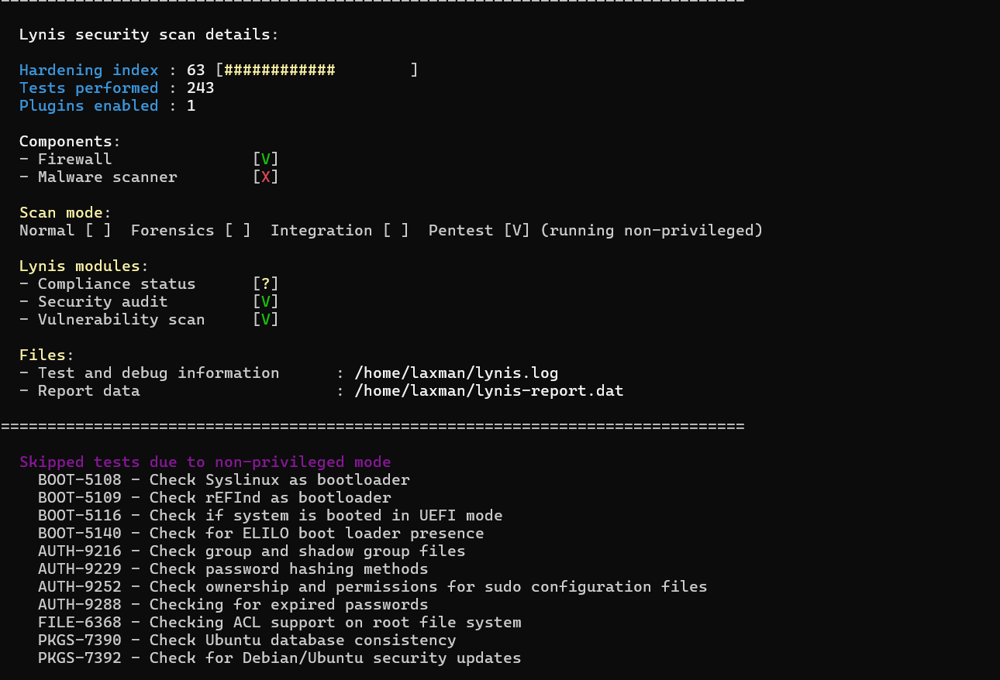
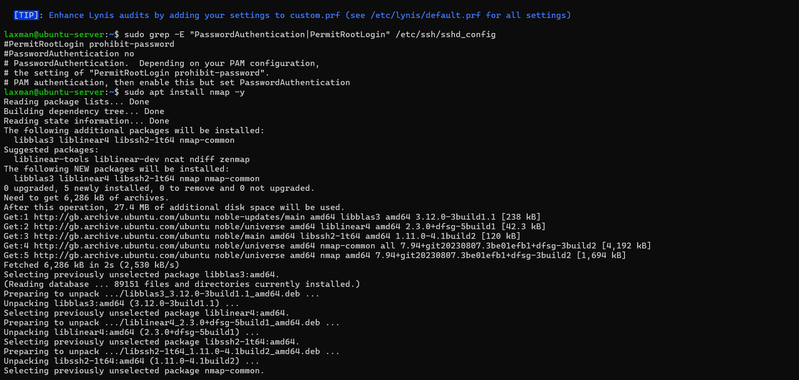
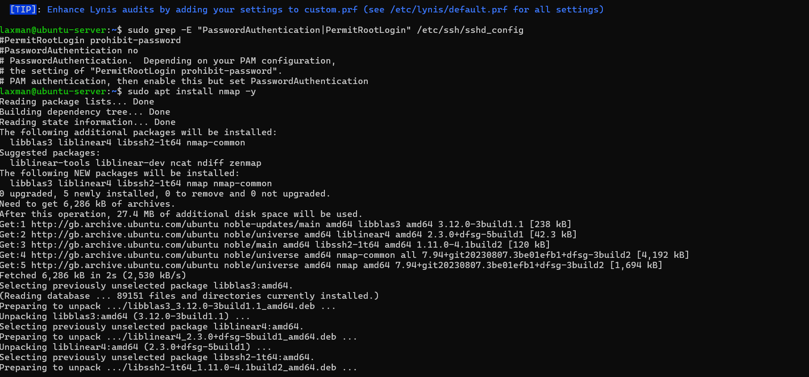
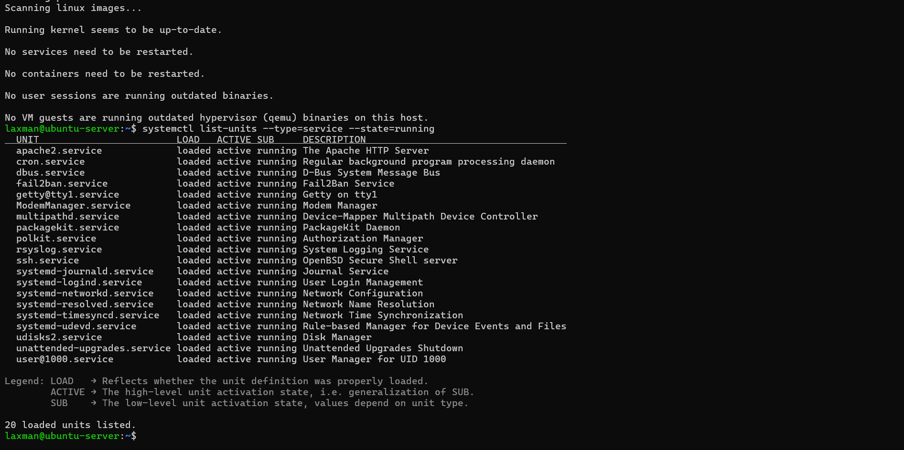

# Week 7 – Security Audit and System Evaluation

## 1. Infrastructure Security Assessment (Lynis)

A full system security audit was conducted using **Lynis 3.0.9** to evaluate the security posture of the Ubuntu Server. The audit assessed operating system hardening, authentication mechanisms, network security, logging, and service configuration.

The audit produced the following results:

- **Hardening Index:** 63  
- **Tests Performed:** 243  
- **Firewall:** Enabled  
- **Malware Scanner:** Not installed  

The achieved hardening index reflects a moderately hardened system suitable for a coursework-based server deployment. The system benefits from SSH hardening, firewall enforcement, AppArmor confinement, Fail2Ban intrusion prevention, and automatic security updates implemented in earlier phases.

Several tests were skipped due to the system running in a **non-privileged virtualised environment**, including bootloader checks, full disk encryption verification, and secure boot validation. These limitations are expected within a VirtualBox-based academic environment and are outside the scope of this assignment.

**Screenshot:**  
`week7_lynis_audit.png`

---

## 2. Lynis Findings and Risk Interpretation

Lynis reported the absence of a dedicated malware scanner such as rkhunter or chkrootkit. This was assessed as a **low-to-moderate risk** due to the following mitigating controls already in place:

- Restricted SSH access using key-based authentication
- Firewall rules limiting inbound traffic to a single trusted host
- Fail2Ban protecting against brute-force attacks
- AppArmor enforcing mandatory access control
- Regular unattended security updates

Given the controlled environment and limited attack surface, the decision not to install additional malware scanning software was justified to maintain system simplicity and reduce unnecessary overhead.

---

## 3. Network Security Assessment (nmap)

A network scan was conducted using **nmap** to identify exposed services and open ports on the server.

The scan confirmed:
- Only **port 22 (SSH)** was open and accessible
- No additional services were exposed to the network

This result confirms effective firewall enforcement and a minimal attack surface.

**Screenshot:**  
`week7_nmap_scan.png`

--- 

## 4. SSH Access Control Verification

SSH configuration was verified to ensure secure remote access policies remained enforced. The following controls were confirmed:

- Password-based authentication disabled
- Direct root login disabled
- Key-based authentication enforced

These settings significantly reduce the risk of brute-force and credential-based attacks.

**Screenshot:**  
`week7_ssh_access_control.png`

---

## 5. Service Inventory and Justification

An audit of all active services was conducted to ensure that only essential services were running.

| Service | Purpose | Justification |
|------|------|------|
| ssh.service | Remote administration | Required for headless server management |
| apache2.service | Web server | Used for performance testing and service evaluation |
| fail2ban.service | Intrusion prevention | Protects SSH against brute-force attacks |
| cron.service | Scheduled tasks | Required for system maintenance and updates |
| rsyslog.service | System logging | Essential for auditing and troubleshooting |
| systemd-networkd | Network configuration | Required for interface management |
| systemd-resolved | DNS resolution | Required for name resolution |
| unattended-upgrades | Automatic updates | Ensures timely security patching |
| polkit / dbus | System authorisation | Required core system components |

No unnecessary or unused services were identified, supporting the principle of **least privilege**.

**Screenshot:**  
`week7_running_services.png`

---

## 6. Remaining Risk Assessment

Despite a strong security baseline, some residual risks remain:

- **No malware scanner installed:** Mitigated by layered security controls and restricted access
- **Virtualised environment limitations:** Secure boot and full disk encryption not implemented due to VM constraints
- **Single administrator account:** Acceptable for coursework but would require role separation in production

Overall, the system demonstrates a well-balanced security posture appropriate for its purpose and deployment context.

---

## 7. Overall System Evaluation

The security audit confirms that the server is securely configured, with strong access control, minimal network exposure, and comprehensive monitoring and logging. The system aligns well with industry best practices for small-scale server deployments and demonstrates effective application of defence-in-depth principles.

##. Week 7 Reflection – Security Audit and System Evaluation

In Week 7, a comprehensive security audit was conducted to evaluate the overall security posture of the Ubuntu Server. The Lynis audit tool was used to assess system hardening, resulting in a hardening index score of 63, indicating a reasonably secure baseline configuration. The audit confirmed that key security controls such as firewall enforcement and secure SSH settings were correctly implemented, while identifying the absence of a malware scanner as a potential improvement area.

Network security testing using Nmap showed that only essential services were exposed, reducing the system’s attack surface. Access control verification confirmed that SSH password authentication was disabled and root login was restricted. A review of running services showed that all active services were necessary and justified. Overall, this phase demonstrated effective security practices while highlighting areas for future hardening.